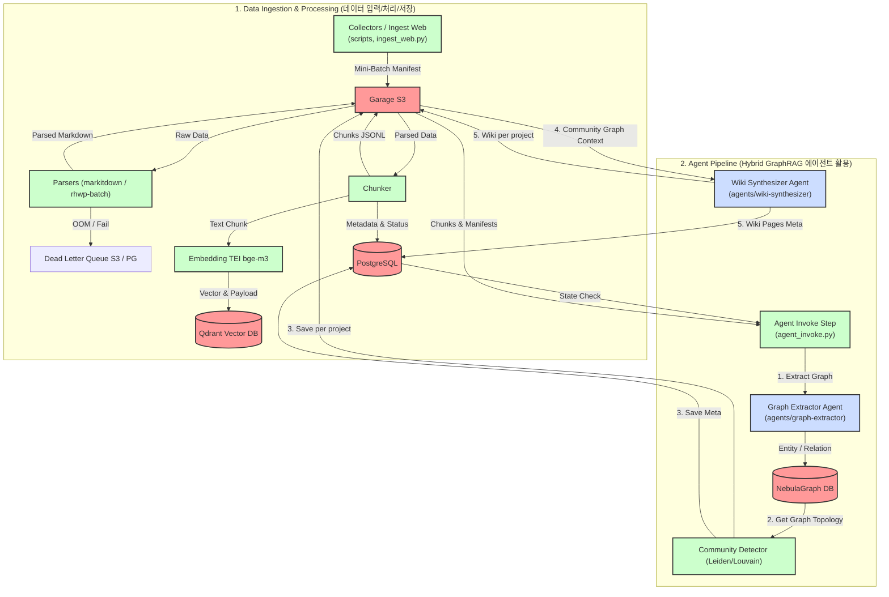

# path-graph Repository Architecture

이 문서는 `path-graph` 지식 파이프라인 저장소의 구성도를 설명합니다. 구성도는 크게 **1. 데이터 입력, 처리, 저장** 및 **2. 에이전트(Agent)의 활용**의 두 부분으로 나뉩니다.

---

## 1. 아키텍처 구성도 (Architecture Diagram)

---

## 2. 세부 파이프라인 흐름 설명

### 1) Data 입력, 처리, 저장 (Data Ingest & Storage)

사용자가 웹 문서나 파일을 입력하면 아래의 일련의 단계를 거쳐 파싱, 청킹, 임베딩된 뒤 각각 저장됩니다.

1. **데이터 수집 및 매니페스트 생성**:
   - `collectors`([collectors](file:///Users/suyoo/Documents/works/path-graph/pipeline/src/path_graph/collectors)) 및 [ingest_web.py](file:///Users/suyoo/Documents/works/path-graph/pipeline/src/path_graph/steps/ingest_web.py)를 통해 데이터를 수집하여 미니배치 형태의 `batch_manifest.jsonl`을 생성합니다.
   - 원본 문서는 S3(Garage) `raw/{tenant}/...`에 적재됩니다.
2. **문서 파싱**:
   - [parsers](file:///Users/suyoo/Documents/works/path-graph/pipeline/src/path_graph/parsers)에서 `markitdown` 혹은 `rhwp-batch` 컨테이너를 사용하여 원본 파일(PDF, HWP, DOC, TXT)을 Markdown 구조화된 텍스트로 변환합니다.
   - 변환된 마크다운 데이터는 `parsed/{tenant}/{doc_id}/content.md`에 저장되며, 파싱 실패 시 `dead_letter` 영역으로 격리됩니다.
3. **텍스트 청킹**:
   - [chunkers](file:///Users/suyoo/Documents/works/path-graph/pipeline/src/path_graph/chunkers)에서 파싱된 문서를 의미 단위 청크로 쪼개어 `chunks/{tenant}/{doc_id}/chunks.jsonl`에 기록합니다.
   - 문서 정보 및 청크 메타데이터는 PostgreSQL 데이터베이스([PostgreSQL 스키마 계약](file:///Users/suyoo/Documents/works/path-graph/ARCHITECTURE.md#22-runtime-postgresql-path_graph-schema))의 `documents`, `chunks` 테이블에 저장되어 관리됩니다.
4. **임베딩 및 벡터 저장 (RAG 준비)**:
   - S3(Garage)에 저장된 청크 파일(`chunks.jsonl`)을 입력으로 읽어와 외부 embedding 서비스(TEI `BAAI/bge-m3`, OpenAI `/v1/embeddings`)로 벡터화합니다.
   - 벡터화된 값은 runtime Postgres `path_graph.chunks.embedding vector(1024)`에 저장됩니다 (cosine, `project_id`·`tenant` Silo).

### 2) Agent 활용 (Hybrid GraphRAG Agent Pipeline)

에이전트와 파이프라인 단계는 순차적으로 맞물려 동작하며 지식 그래프를 도출하고 커뮤니티 단위 위키를 합성합니다.

1. **지식 그래프 추출 (Graph Extractor)**:
   - [agent_invoke.py](file:///Users/suyoo/Documents/works/path-graph/pipeline/src/path_graph/steps/agent_invoke.py)를 통해 [agents/graph-extractor](file:///Users/suyoo/Documents/works/path-graph/agents/graph-extractor) 에이전트를 비동기 호출합니다.
   - 에이전트는 청크 리스트를 분석하여 엔티티(Entity)와 관계(Relation)를 추출하고 Graph DB인 NebulaGraph([NebulaGraph 스펙](file:///Users/suyoo/Documents/works/path-graph/ARCHITECTURE.md#24-nebulagraph-test_infra-소비만))에 적재합니다.
2. **커뮤니티 탐색 (Community Detection, project별)**:
   - 추출 완료 후, 파이프라인이 NebulaGraph Space(`path_graph_{tenant}_{project}`) 단위로 Leiden 커뮤니티 탐색을 수행합니다. **Space 간 merge는 하지 않습니다.**
   - 결과는 `communities/{tenant}/{project}/{batch_id}/communities.jsonl` 및 PostgreSQL `communities` 테이블에 적재됩니다.
3. **위키 페이지 합성 (Wiki Synthesizer, project·community별)**:
   - `graph_context/{tenant}/{project}/{batch_id}/{community_id}.json`을 입력으로 wiki-synthesizer가 community report 형태의 위키를 합성합니다.
   - 생성 파일: `wiki/{tenant}/{project}/{page_slug}.md`, 메타: PostgreSQL `wiki_pages` (`project`, `community_id`).

---

## 3. 핵심 규칙 요약
- **테넌트 격리**: 모든 저장소(S3, Postgres, Qdrant, NebulaGraph)에서 `tenant` 식별자가 1차 파티션 키로 사용되어 물리/논리적 격리를 유지합니다.
- **멱등성**: 중복 실행 시에도 데이터 손상이나 중복을 막기 위해 모든 저장소 쓰기는 `document_id` 또는 `chunk_id` 기반의 **Upsert/Merge**로 동작합니다.
