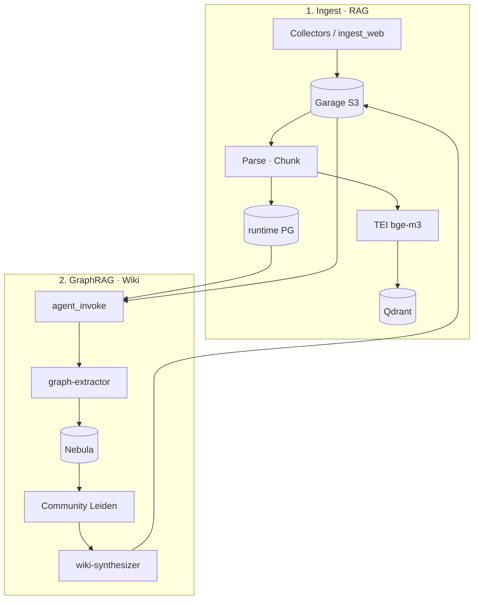

# path-graph

**RAG · Graph · Wiki** 지식 파이프라인. 문서를 수집·파싱·청킹한 뒤 벡터 인덱스(Qdrant), 지식 그래프(Nebula), 커뮤니티 위키(S3)로 적재한다. 오케스트레이션은 **Argo Workflows + Hera**, 불변 계약은 [ARCHITECTURE.md](ARCHITECTURE.md).

## 무엇을 하는가

| 단계 | 산출물 |
|------|--------|
| Collect | `raw/{tenant}/…`, `batches/…/manifest.jsonl` |
| Parse · Chunk | `parsed/…`, `chunks/…/chunks.jsonl`, PG 메타 |
| RAG | Qdrant point + `document_ingest_state.rag_at` |
| Graph · Wiki | Nebula upsert, `wiki/{tenant}/{project}/…` |

상세 흐름: [ARCHITECTURE.md §2](ARCHITECTURE.md#2-컴포넌트-간-형태) · 구현: [pipeline/DESIGN.md](pipeline/DESIGN.md)

## 지금 되는 것 / 아직 안 되는 것

| ✅ 로컬 CLI | ⏳ 미완 (→ [ROADMAP.md](ROADMAP.md)) |
|-------------|--------------------------------------|
| web / file / SharePoint / GDrive / OneDrive ingest | manifest ↔ WorkflowTemplate 정합 (2.4.1) |
| parse → chunk → (선택) RAG | RLS policy, `pipeline_runs` 전 단계 기록 |
| `wire-dev.sh` port-forward | WF E2E on cluster (이미지 import 후) |
| `make bootstrap-k8s` | Argo + secrets + dev overlay |
| Filestash (Garage UI) | http://filestash.k8s-test — [deploy/SETUP.md](deploy/SETUP.md) |
| Qdrant Dashboard | http://qdrant.k8s-test:6333/dashboard — API key `test-qdrant-api-key` |
| `./scripts/submit-ingest-rag-e2e.sh` | WF E2E (manifest line → ingest) |

## 아키텍처 (한 장)



## 의존 (외부)

| 컴포넌트 | 저장소 |
|---|---|
| Agent invoke, Garage, runtime PG | [agents-runtime](../agents-runtime) |
| Qdrant, NebulaGraph | path-graph [`deploy/k8s/infra/`](deploy/k8s/infra/) |
| HWP 파서 | [rhwp_batch](../rhwp_batch) |

## Quickstart (로컬)

```bash
# k8s dev 클러스터에 path-graph 의존 infra가 떠 있어야 함
#   ../agents-runtime — make k8s-apply-dev
#   path-graph        — make deploy-qdrant-nebula (Qdrant + NebulaGraph)

make install
./scripts/wire-dev.sh up          # port-forward → 127.0.0.1
./scripts/wire-dev.sh env         # .env.dev.local 생성
make test
```

로컬 RAG 시 TEI port-forward 후 `EMBEDDING_BASE_URL=http://127.0.0.1:8085` 로 override (포트 맵: [`scripts/wire-dev.env.example`](scripts/wire-dev.env.example)).

수동 env 템플릿: [`.env.dev.local.example`](.env.dev.local.example)

## 파이프라인 CLI (개발)

```bash
source .venv/bin/activate

# 웹 / 로컬 파일
python -m path_graph.steps.ingest_web --tenant dev --url https://example.com
python -m path_graph.steps.ingest_web --tenant dev --file ./sample.pdf --rag

# SharePoint / GDrive / OneDrive (자격 증명은 .env.dev.local)
python -m path_graph.steps.ingest_sharepoint --tenant dev --folder 회사규정 --dry-run
python -m path_graph.steps.ingest_gdrive --tenant dev --folder-path Reports --rag
python -m path_graph.steps.ingest_onedrive --tenant dev --folder Documents --dry-run
```

K8s 배포: [deploy/SETUP.md](deploy/SETUP.md)

```bash
git push origin main && make build-images   # GHCR 이미지 (로컬 docker 없음)
make k8s-apply-dev                          # dev overlay apply
```

## VS Code 디버그

`.vscode/launch.json` — `Wire: dev cluster`로 k8s port-forward 후 `Debug: ingest_web` / `Debug: pytest` 실행. 사전에 Python 확장(debugpy)과 `make install`(.venv) 필요.
