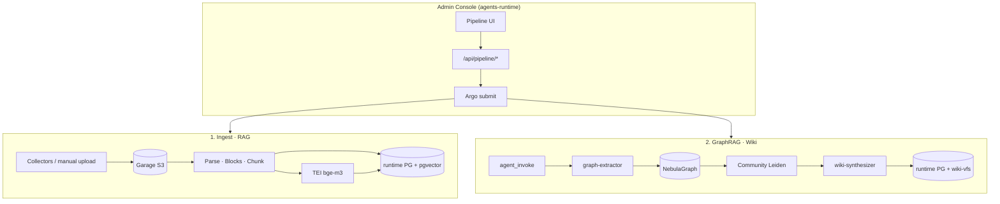

# path-graph 개발 가이드

새로 참여하는 개발자를 위한 문서입니다. **전체 구성**, **동작 방식**, **기술적 특이 사항**을 중심으로 설명합니다.

불변 계약·스키마 정본은 [ARCHITECTURE.md](../ARCHITECTURE.md), 내부 구현은 [pipeline/DESIGN.md](../pipeline/DESIGN.md), 배포 설계는 [deploy/DESIGN.md](../deploy/DESIGN.md)를 참고하세요.

---

## 1. path-graph란

path-graph는 문서를 수집·파싱·청킹한 뒤 아래 세 채널로 지식을 적재하는 **RAG · Graph · Wiki 파이프라인**입니다.

| 채널 | 저장소 | 소비 방식 |
|------|--------|-----------|
| **RAG** | runtime PostgreSQL `path_graph.chunks.embedding` (pgvector) | `knowledge_search(mode=basic)` |
| **Graph** | NebulaGraph Space + PG `path_graph.entities` mirror | `knowledge_search(mode=local\|drift)` |
| **Wiki** | PG `wiki_pages` + `vfs_wiki_files` 본문 | `knowledge_search(mode=global)` · VFS |

오케스트레이션은 **Argo Workflows** (`deploy/k8s/base/workflow-templates/`). Admin Console UI·BFF는 **agents-runtime**에 통합되어 있으며, path-graph 패키지는 `path_graph.console` 공개 API만 외부에 노출합니다.

---

## 2. 저장소 구성

```
path-graph/
├── pipeline/              # 핵심 Python 패키지 (path_graph)
├── agents/
│   ├── graph-extractor/   # LangGraph — 엔티티·관계 추출
│   └── wiki-synthesizer/  # LangGraph — 커뮤니티 위키 합성
├── deploy/k8s/
│   ├── base/              # WorkflowTemplate, SA, ConfigMap, Filestash
│   ├── infra/             # NebulaGraph (Helm + manifest)
│   ├── argo/              # Argo Workflows Helm values
│   └── overlays/dev/      # GHCR 이미지 SHA 태그
├── scripts/               # wire-dev, 배포, E2E, secrets
├── docs/                  # 본 문서·운영 가이드
├── ARCHITECTURE.md        # 컴포넌트 간 계약 (정본)
├── ROADMAP.md             # 진행 상태·갭
└── Makefile               # install, test, k8s-apply-dev 등
```

### 외부 의존 저장소

| 저장소 | path-graph가 사용하는 것 |
|--------|--------------------------|
| [agents-runtime](../agents-runtime) | Garage S3, runtime PG(pgvector), `POST /v1/agents/jobs` |
| [rhwp_batch](../rhwp_batch) | HWP/HWPX 파서 컨테이너 (`rhwp-batch`) |

path-graph는 **NebulaGraph·Argo Workflows**를 자체 `deploy/k8s/`에서 설치·운영합니다.

---

## 3. 아키텍처 한 장



### 데이터 흐름 요약

1. **Collect** — SharePoint/GDrive/OneDrive/웹/수동 업로드 → `raw/{tenant}/{project_id}/…` + `batches/{tenant}/{batch_id}/manifest.jsonl`
2. **Parse · Chunk** — markitdown / rhwp-batch / VL OCR → `parsed/…`, `chunks/…/chunks.jsonl`, PG `documents`·`chunks`
3. **RAG** — TEI 임베딩 → `chunks.embedding` (1024 dim, cosine)
4. **GraphRAG** — graph-extractor → Nebula upsert → Leiden community → wiki-synthesizer → PG VFS

상세 S3 키 레이아웃·PG 스키마: [ARCHITECTURE.md §2](../ARCHITECTURE.md#2-컴포넌트-간-형태)

---

## 4. 핵심 개념

### tenant · project

- **`tenant`** — 보안·격리의 1차 파티션 키. 모든 S3 prefix, PG 행, Nebula Space, Argo 파라미터에 **필수**. 생략·추론·`default` 폴백 금지.
- **`project`** — 사용자가 정의한 **Knowledge Bundle** (`project_id` UUID). 수집·RAG·graph·wiki가 동일 경계에 닫힙니다.
- **`source`** — project 직속 수집 출처 (`path_graph.sources.project_id` FK).

### 멱등성

- `document_id` = UUIDv5(`{tenant}:{project_id}:{content_hash}`)
- `chunk_id` = UUIDv5(`{tenant}:{document_id}:{chunk_index}:{chunk_text_hash}`)
- 동일 키 재실행 시 **Upsert/Merge**만 허용. S3 raw는 content_hash prefix로 **overwrite 금지**.

### ingest_state 전이

| 상태 | 의미 |
|------|------|
| `pending` | raw·parsed 적재 전/중 |
| `indexed_rag` | pgvector upsert 완료 |
| `indexed_graph` | GraphRAG(graph+wiki) 완료 |
| `dead_letter` | parse 등 복구 불가 격리 |
| `purged` | tombstone·인덱스 제거 완료 |

### 저장소 역할 분담

| 저장소 | 역할 |
|--------|------|
| **Garage S3** | artifact source of truth (raw, parsed, chunks, graph_context 등) |
| **runtime PG** | 메타·상태·벡터·wiki 본문(`vfs_wiki_files`) |
| **NebulaGraph** | 그래프 탐색용 파생 인덱스 (project당 Space 1개) |

---

## 5. pipeline 패키지 구조

```
pipeline/src/path_graph/
├── steps/           # Argo step·CLI 진입점
├── collectors/      # SharePoint, GDrive, OneDrive, web
├── parsers/         # markitdown, rhwp-batch, VL OCR
├── chunkers/        # blocks → chunks
├── contracts/       # JSON 스키마·S3 키·binding (정본)
├── admin/           # BFF·Argo 내부 도메인 (외부 import 금지)
├── console/         # 외부 공개 API facade
├── storage/         # BlobStore (local / S3)
├── meta/pg.py       # PG 스키마·RLS·검색
├── rag/embed.py     # TEI OpenAI-compatible embed
├── graph/           # Nebula upsert, community, graph_context
└── lifecycle/       # purge, compensation, reconcile
```

### 주요 WorkflowTemplate

| 템플릿 | 용도 |
|--------|------|
| `pipeline-collect-ingest-rag` | 수집 → ingest → RAG |
| `pipeline-ingest-rag` | manifest 기반 map ingest |
| `pipeline-graphrag` | graph + community + wiki |
| `pipeline-purge-document` / `pipeline-purge-project` | 정보삭제 |
| `pipeline-reconcile-index` | PG truth 기준 Nebula 고아 정리 (Cron) |
| `pipeline-artifact-cleanup` | temp S3 정리 |

### Admin Console 연동

- BFF: agents-runtime `backend/routers/pipeline.py` — HTTP·CSRF·Argo submit만
- path-graph 도메인: `path_graph.admin.*` (내부) → 외부는 `path_graph.console.*`만 import
- Pipeline Pod는 `users` 테이블 미사용 — WF 파라미터 `tenant` + ServiceAccount

---

## 6. 개발 환경 설정

### 요구 사항

- Python **3.12** (`.python-version`, CI, Docker 동일)
- [uv](https://github.com/astral-sh/uv) — venv·패키지 관리
- k8s dev 클러스터 (agents-runtime `runtime` NS + path-graph Nebula)

### Quickstart

```bash
# 1. 의존 infra (별도 저장소·클러스터)
#    agents-runtime: make k8s-apply-dev
#    path-graph:     make deploy-nebula

# 2. 로컬 개발 환경
make install
./scripts/wire-dev.sh up          # PG :5432, Envoy :8084, Nebula :9669
./scripts/wire-dev.sh env         # .env.dev.local 생성
make test
```

포트 맵: [`scripts/wire-dev.env.example`](../scripts/wire-dev.env.example)

TEI(임베딩) 로컬 사용 시:

```bash
kubectl -n llm-serving port-forward svc/bge-m3-tei 8085:8080
# .env.dev.local: EMBEDDING_BASE_URL=http://127.0.0.1:8085
```

### 로컬 ingest CLI

```bash
source .venv/bin/activate

python -m path_graph.steps.ingest_web --tenant dev --url https://example.com
python -m path_graph.steps.ingest_web --tenant dev --file ./sample.pdf --rag

python -m path_graph.steps.ingest_sharepoint --tenant dev --folder 회사규정 --dry-run
python -m path_graph.steps.ingest_gdrive --tenant dev --folder-path Reports --rag
```

---

## 7. 개발 방식

### TDD

1. 코드 스켈레톤 → **테스트 먼저** → 구현
2. `make test` — pipeline 디렉터리에서 pytest (현재 289 tests)
3. 계약·스키마 변경 시 [ARCHITECTURE.md](../ARCHITECTURE.md)와 테스트를 **함께** 수정

### 문서 우선

| 변경 종류 | 갱신 문서 |
|-----------|-----------|
| 불변 규칙·스키마 | `ARCHITECTURE.md` |
| 내부 구현·step | `pipeline/DESIGN.md` |
| 배포·K8s | `deploy/DESIGN.md`, `deploy/SETUP.md` |
| 일정·갭 | `ROADMAP.md` |

---

## 8. 기술적 특이 사항

### Blocks 구조화 (D3)

PDF/DOCX 등은 **md 생성**과 **blocks 추출**을 분리합니다.

```
bytes → parse (markitdown | rhwp-batch | VL OCR)
      → blocks extractor (BLOCKS_EXTRACTOR=md_heuristic)
      → content.json (blocks[])
      → chunk_from_blocks
```

청킹은 항상 `content.json` `blocks[]`만 본다. 파서 교체 시 blocks 추출기만 바꿀 수 있습니다.

### Mini-batch + Argo map

- 문서 1건 = Workflow 1개 **금지** (소량 수동 제외)
- 수집기는 기본 **100건** mini-batch로 `manifest.jsonl` 생성
- `pipeline-ingest-rag`가 `withParam` map으로 병렬 ingest (`max_parallel` 기본 10)
- parse 실패는 해당 파일만 `dead_letter` — 배치 나머지는 `on-error: continue`

### Agent invoke (비동기 poll)

동기 `POST /v1/agents/invoke` 장시간 홀딩 대신:

1. `POST /v1/agents/jobs` → `job_id` 즉시 수신
2. `GET /v1/agents/jobs/{job_id}` 5s 간격 poll (max 2h)
3. (선택) Argo `suspend` + agents-runtime callback resume

graph-extractor·wiki-synthesizer는 **presigned S3 URL**로 artifact를 받습니다 — agent pool에 Garage credential이 없습니다.

### 외부 LLM·Embedding (D4)

path-graph 이미지에 모델을 **내장하지 않습니다**. env만 교체:

| env | 용도 |
|-----|------|
| `EMBEDDING_BASE_URL` | TEI `BAAI/bge-m3`, dim 1024 |
| `OCR_LLM_BASE_URL` | 스캔 PDF VL OCR (선택) |
| `ENVOY_URL` + `PIPELINE_AGENT_ACCESS_TOKEN` | agent jobs |

### Nebula entity VID

Nebula `FIXED_STRING(64)`는 UTF-8 바이트 상한. 한글·긴 조문명은 `entity_vid(name)` = UUIDv5로 정규화하고 원문은 `Entity.name` property에 저장합니다.

### RLS (Row Level Security)

`path_graph.*` 전 테이블에 `tenant = current_setting('app.tenant')` POLICY. 쿼리 전 `set_config('app.tenant', …)` 필수.

### Semaphore (동시성 제한)

ConfigMap `path-graph-limits`:

| 키 | 기본 | 의미 |
|----|------|------|
| `ingest-map` | 10 | ingest map 동시 실행 |
| `embed` | 16 | embed step |
| `agent-invoke` | 8 | graph+wiki agent 동시 |
| `parse-hwp` | 4 | rhwp-batch CPU bound |

---

## 9. 자주 쓰는 명령

```bash
make install                    # editable install
make test                       # pytest
make workflow-validate          # kubectl dry-run (WF 템플릿)
make kustomize-build            # dev overlay 렌더 확인

make bootstrap-k8s              # 최초: Argo + secrets + dev overlay
make k8s-apply-dev              # 이미지 SHA pin + apply
make build-images               # GHA workflow_dispatch → GHCR

make e2e-ingest-rag             # Argo ingest E2E
make e2e-downstream             # graphrag E2E (기본 skip_agent=1)
```

VS Code: `.vscode/launch.json` — `Wire: dev cluster` 후 `Debug: ingest_web` / `Debug: pytest`

---

## 10. 관련 문서

| 문서 | 용도 |
|------|------|
| [README.md](../README.md) | 저장소 소개·quickstart |
| [ARCHITECTURE.md](../ARCHITECTURE.md) | 계약·스키마 정본 |
| [pipeline/DESIGN.md](../pipeline/DESIGN.md) | step·agent·collector 내부 설계 |
| [deploy/SETUP.md](../deploy/SETUP.md) | K8s apply/rollback 런북 |
| [docs/운영가이드.md](./운영가이드.md) | 설치·모니터링·장애 대응 |
| [ROADMAP.md](../ROADMAP.md) | 미완·다음 작업 |
| [AGENTS.md](../AGENTS.md) | AI 에이전트·기여자 작업 규칙 |
